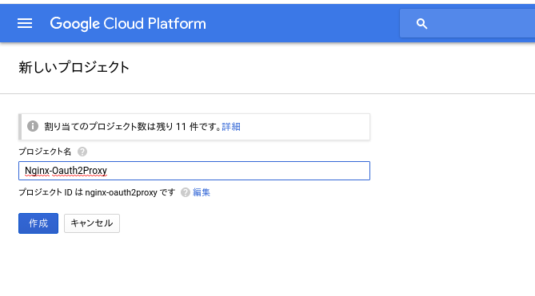
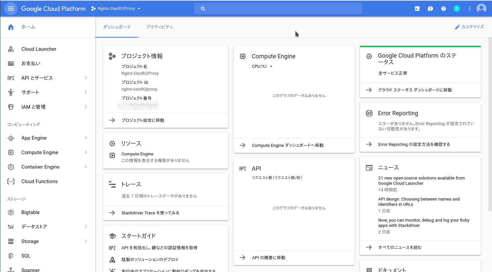
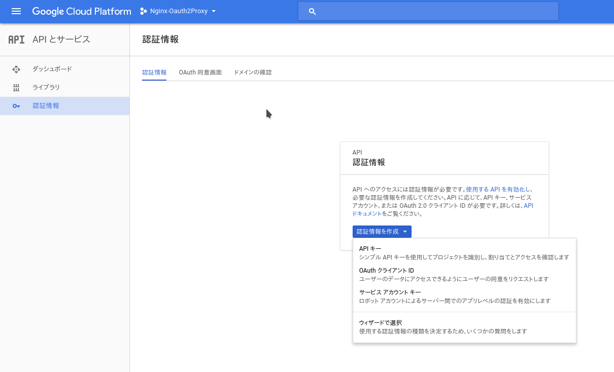
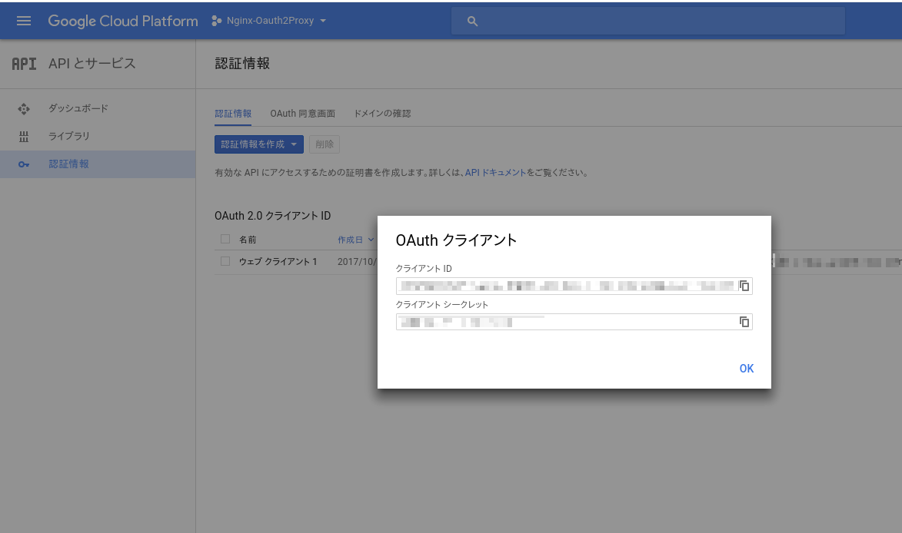
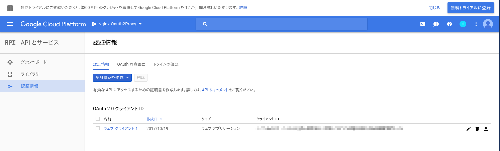
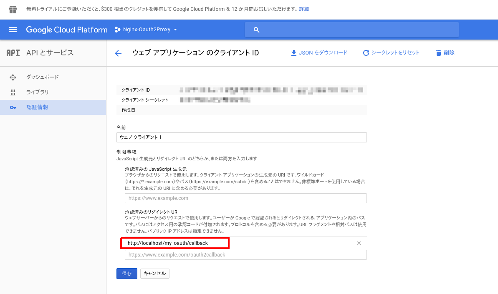

# Boilerplate of combination Nginx and oauth2_proxy 

[oauth2_proxy](https://github.com/bitly/oauth2_proxy) is awesome proxy you can use it with Nginx really easy.

This repo provides boilerplate of combination of those.
(This boilerplate using google authentication.)

## Preparing

1. You need creating a project on GCP.

    

1. Click API and Service on left side of the project home.

    

1. Choose Oauth Client ID from auth info tab on API and service page.

    

1. You can get Client ID and Client secret.

    

1. Register redirect URI

    1. Click your OAuth 2.0 Client ID name link.

        

    1. Add `http://localhost/my_oauth/callback` which is defined at `./Nginx/custom_conf/nginx_oauth.conf`

        

## Start simply

Modify `./OAuth2Proxy/extra_whitelist.txt` first.

It will be passed to `authenticated-emails-file` option. [See here](https://github.com/bitly/oauth2_proxy#command-line-options)

After that, you can run this repo with `docker-compose up --buil -d`.

Open `http://localhost` then you can see `./Nginx/general/index.html`

Open `http://localhost/team/` then you can see `./Nginx/only_team/index.html` after authentication.
